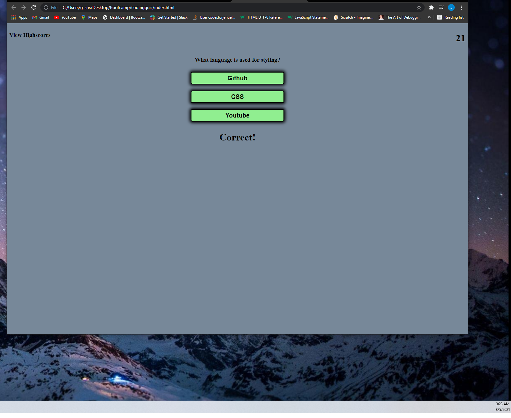
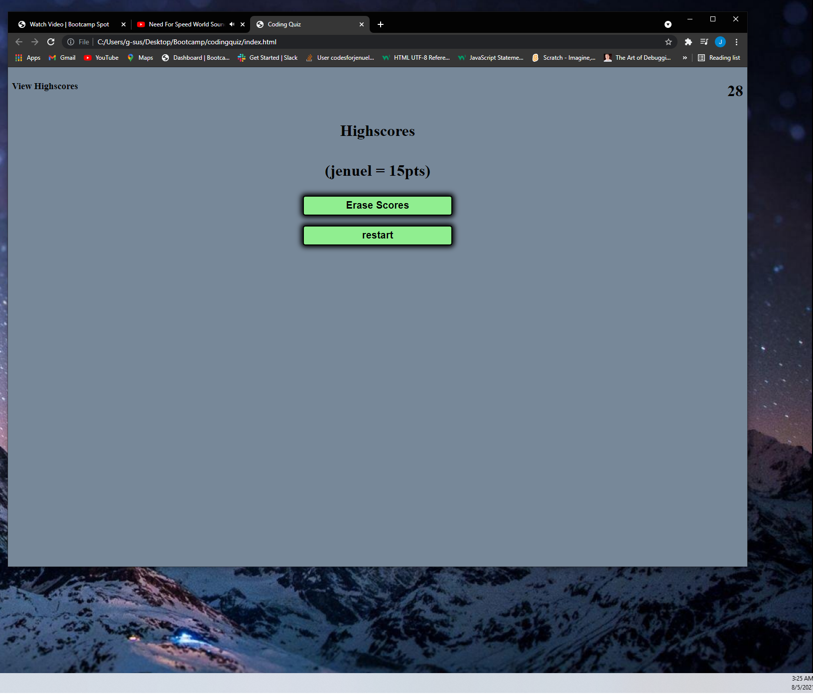

# codingquiz

This is a coding quiz:
it allows the user to face a challenge of questions that relate
to the web developer field. This quiz was built with html,
css, and javascript, with javascript taking the biggest contributor.
HTML gave the quiz its buttons, input, text, and elements, CSS gave its colors, positioning, making it more confortable to the user's eye, Javascript giving it its functionality with the help of eventListeners, functions, local storage, and more.

here is 2 screenshots of the website functioning.

# screenshot

here is the link to my repository

https://codesforjenuel.github.io/codingquiz/

